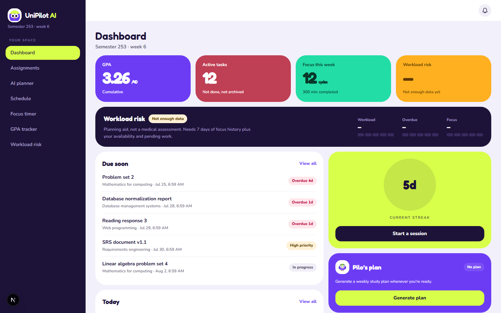
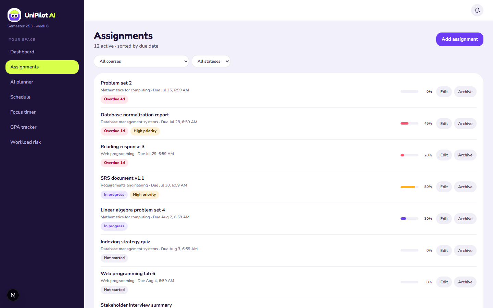
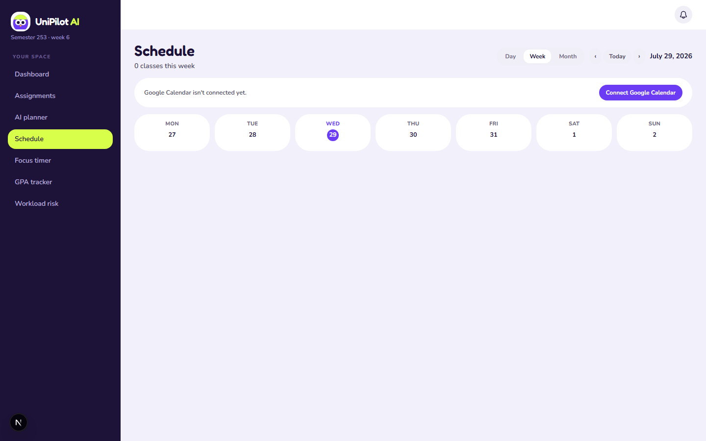
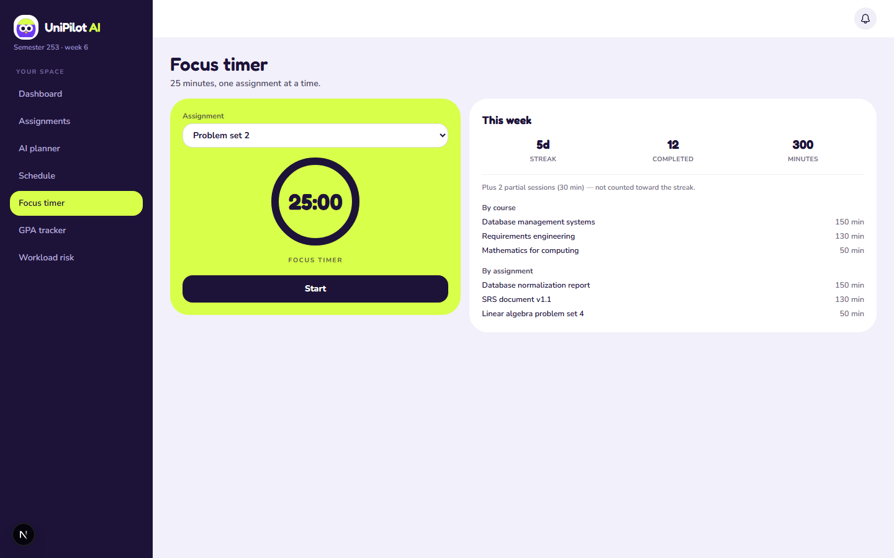
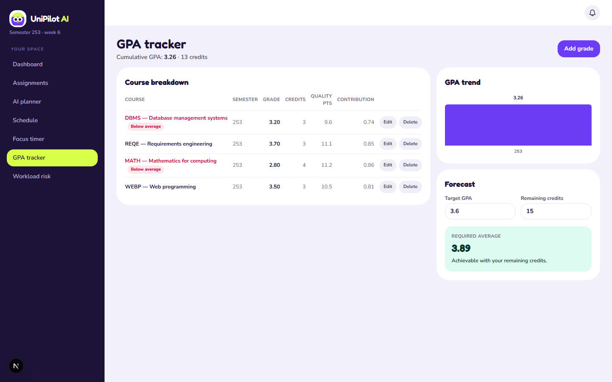
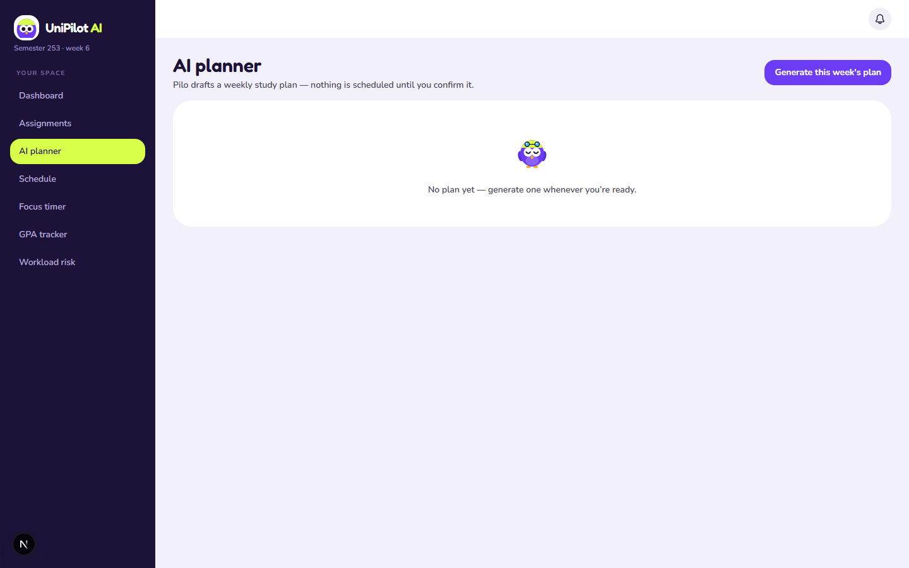
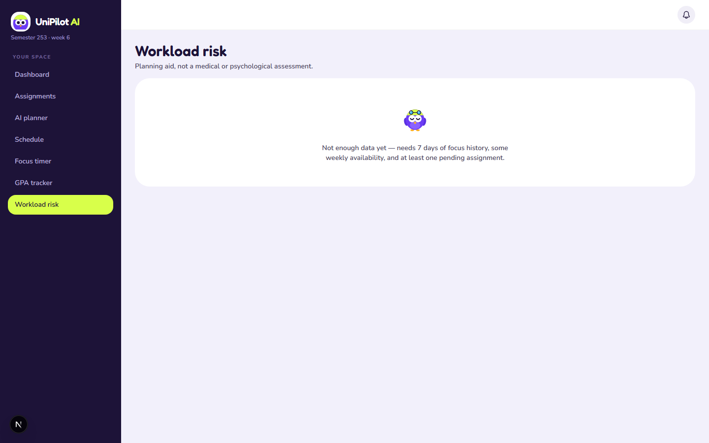

# UniPilot AI

A personal Student Life OS — assignments, schedule, focus timer, GPA, an AI study planner, and workload-risk tracking in one place, built with Next.js, Supabase, and Gemini.



## What it does

- **Assignments** — create, edit, archive, filter by course/status, sorted by due date with overdue/priority labelling.
- **AI study planner** — Gemini drafts a weekly study schedule around your assignments, class blocks, and free time; nothing is ever scheduled until you review and confirm the draft.
- **Google Calendar sync** — pulls your class schedule in as read-only blocks the planner and schedule view both respect.
- **Focus timer** — 25-minute Pomodoro sessions logged against an assignment, with streaks and weekly stats.
- **GPA tracker** — cumulative GPA, per-course breakdown, and a forecast of the average you'd need to hit a target.
- **Workload risk** — a daily 0–100 score from overdue work, upcoming load, and recent focus time, with a plain-language explanation and top suggestion.
- **Notifications** — in-app + web push reminders for assignment due dates and workload warnings.
- **Offline mode** — already-visited pages keep working without a connection; edits made offline queue up and sync automatically once you're back online.

## Screenshots

| Dashboard                                    | Assignments                                      | Schedule                                   |
| -------------------------------------------- | ------------------------------------------------ | ------------------------------------------ |
|  |  |  |

| Focus timer                          | GPA tracker                      | AI planner                               | Workload risk                      |
| ------------------------------------ | -------------------------------- | ---------------------------------------- | ---------------------------------- |
|  |  |  |  |

## Tech stack

- **Next.js 16** (App Router, Server Components, Server Actions, Turbopack) + React 19 + TypeScript
- **Supabase** (Postgres, Auth, Row Level Security) — every table scoped to `user_id = auth.uid()`
- **Tailwind CSS v4** (CSS-first `@theme` tokens, no `tailwind.config.ts`)
- **Gemini API** (`gemini-2.5-flash`) for the AI study planner, called only from a server Route Handler
- **Google Calendar API** (OAuth2) for read-only class schedule sync
- **Web Push** (`web-push` + a service worker) for browser notifications
- **Vitest** for unit tests on the pure business-logic layer (`lib/rules/*`)

## Architecture notes

- All domain/business logic (validation, scoring, classification, sorting) lives in `lib/rules/*.ts` as pure functions — imported by both client components and server actions so each rule is defined exactly once.
- API keys and secrets never reach the client bundle: Gemini, Google OAuth, and the calendar token-encryption key are only ever read inside `"server-only"`-guarded files or Route Handlers.
- Row Level Security guards every table's own `user_id`, but cross-table references (e.g. an assignment's `course_id`) are explicitly re-validated server-side against the caller — RLS alone doesn't stop an IDOR through a foreign key.
- A Google Calendar refresh token is encrypted (AES-256-GCM) before being stored in Postgres.

## Getting started

### Prerequisites

- Node.js 20+
- A [Supabase](https://supabase.com) project
- A [Google Cloud](https://console.cloud.google.com) project with the Calendar API enabled and an OAuth 2.0 client (for calendar sync)
- A [Gemini API key](https://aistudio.google.com/apikey) (for the AI planner)

### Setup

```bash
npm install
cp .env.local.example .env.local   # fill in the values below
```

Apply the database schema (see `supabase/migrations/`) to your Supabase project — either via the Supabase CLI (`supabase db push --linked`) or by running each migration in the SQL editor in order.

```bash
npm run dev
```

Open [http://localhost:3000](http://localhost:3000).

### Environment variables

| Variable                                             | Where to get it                                                              |
| ---------------------------------------------------- | ---------------------------------------------------------------------------- |
| `NEXT_PUBLIC_SUPABASE_URL`                           | Supabase project → Settings → API                                            |
| `NEXT_PUBLIC_SUPABASE_ANON_KEY`                      | Supabase project → Settings → API                                            |
| `SUPABASE_SERVICE_ROLE_KEY`                          | Supabase project → Settings → API (server-only, never exposed to the client) |
| `GOOGLE_CLIENT_ID` / `GOOGLE_CLIENT_SECRET`          | Google Cloud Console → APIs & Services → Credentials (OAuth client)          |
| `GOOGLE_REDIRECT_URI`                                | `http://localhost:3000/api/calendar/oauth/callback` in dev                   |
| `CALENDAR_TOKEN_ENCRYPTION_KEY`                      | Generate with `openssl rand -base64 32`                                      |
| `GEMINI_API_KEY`                                     | [Google AI Studio](https://aistudio.google.com/apikey)                       |
| `NEXT_PUBLIC_VAPID_PUBLIC_KEY` / `VAPID_PRIVATE_KEY` | Generate with `npx web-push generate-vapid-keys`                             |
| `VAPID_SUBJECT`                                      | `mailto:you@example.com`                                                     |

For the Google OAuth consent screen in "Testing" mode, add your own Google account under **Test users** or the calendar connect flow will fail with `access_denied`.

## Scripts

```bash
npm run dev            # start the dev server (Turbopack)
npm run build          # production build
npm run start           # run the production build
npm run lint             # ESLint
npm run test              # Vitest — pure lib/rules/* logic
npm run format:check      # Prettier check
node scripts/seed.mjs     # reset the dev account to a clean seeded state
```

## Project structure

```
app/                  Routes (App Router) — pages, Server Actions, Route Handlers
components/            UI, grouped by feature
lib/rules/              Pure business logic — validation, scoring, classification
lib/supabase/           Supabase client + generated types + ownership checks
lib/gemini/             AI planner prompt/schema/client
lib/calendar/           Google Calendar OAuth + sync + token encryption
lib/push/, lib/offline/ Web push and offline-queue infrastructure
supabase/migrations/    SQL migrations, applied in order
tests/                  Vitest specs mirroring lib/rules/ and lib/calendar/
docs/                   Design system, build roadmap, traceability, screenshots
```

## Testing

- `npm run test` runs the unit test suite against every pure `lib/rules/*` function (validation, GPA math, risk scoring, plan session validation, focus classification) plus the calendar event mapper and token encryption.
- Every phase of this build was additionally verified with real browser testing (Playwright) against a running dev/production server — including live Gemini calls, the Google Calendar OAuth redirect, and push notification permission flows — not just type-checking and unit tests.
- See `docs/TRACEABILITY.md` for which file and test covers each functional requirement.
